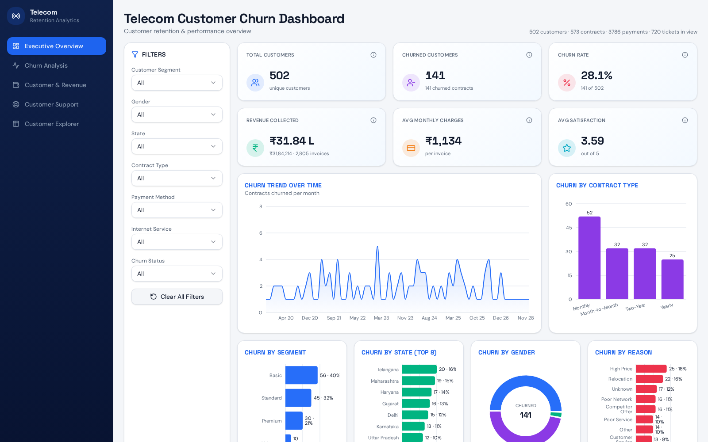

# Telecom Customer Churn Dashboard

An interactive analytics dashboard for a telecom operator: customer churn, revenue,
and support performance in one place, with cross-cutting filters and drill-down views.

Built with **TanStack Start**, **React 19**, **TypeScript**, **Tailwind CSS v4** and **Recharts**.



---

## Overview

The dashboard turns five raw operational tables (customers, services, contracts,
payments, support tickets) into a single filtered analytical model rendered across
five views.

| View | What it answers |
| --- | --- |
| **Overview** | Headline KPIs, churn trend over time, churn by segment / state / gender / contract |
| **Churn** | Churn reasons, tenure-at-churn distribution, contract starts vs. churns per month |
| **Revenue** | Collected revenue trend, payment methods, status mix, average charge by segment |
| **Support** | Ticket volume, resolution rate, resolution time, satisfaction distribution |
| **Customers** | Searchable customer explorer with revenue, ticket count and churn status |

### Key metrics

- Total & churned customers, churn rate
- Revenue collected, failed / overdue exposure, discounts given
- Average monthly charge per invoice
- Average satisfaction score and resolution time

Every KPI card has a clickable ⓘ that explains exactly how the number is computed.

### Filters

Segment · Gender · State · Contract type · Payment method · Churn status · Internet service.
Filters apply to a single scoped dataset, so every chart in every view stays consistent.

---

## Data

| Source table | Rows (cleaned) | Purpose |
| --- | --- | --- |
| `customers.json` | 502 | Demographics, location, segment, subscribed services |
| `contracts.json` | 573 | Contract type, tenure, churn status / date / reason |
| `payments.json` | 3,790 | Monthly charges, method, status, discounts |
| `tickets.json` | 720 | Issue type, priority, resolution time, satisfaction |

The CSV sources were cleaned with DuckDB before export:

- Deduplicated on primary keys (`ContractID`, `PaymentID`, `TicketID`)
- Mixed date formats (ISO and `DD/MM/YYYY`) normalised to ISO
- Implausible `MonthlyCharges` outliers removed (kept `0 – 20,000`)
- Categorical values (state, service names) normalised for reliable filtering
- `NULL` churn reasons mapped to `Unknown`

Currency is formatted with Indian conventions (Lakh / Crore).

---

## Tech stack

- **Framework:** TanStack Start (file-based routing, SSR-ready)
- **UI:** React 19, Tailwind CSS v4, shadcn/ui primitives, lucide-react icons
- **Charts:** Recharts (line, area, bar, donut wrappers in `Charts.tsx`)
- **Language:** TypeScript, strict mode
- **Build:** Vite 7

Theming uses OKLCH design tokens defined in `src/styles.css` — no hardcoded colours in components.

---

## Project structure

```text
src/
  data/                     cleaned JSON datasets
  lib/dashboard-data.ts     types, filter engine, aggregation + formatting helpers
  components/dashboard/
    ChartCard.tsx           chart container
    KpiCard.tsx             KPI tile with info popover
    FilterPanel.tsx         sidebar filters
    Charts.tsx              Recharts wrappers
    views/                  Overview, Churn, Revenue, Support, Customers
  routes/
    __root.tsx              app shell, fonts, metadata
    index.tsx               dashboard layout + navigation + filter state
```

---

## Running locally

Requires Node.js 20+.

```sh
git clone <this-repository-url>
cd <repository-name>
npm install
npm run dev
```

The app runs at `http://localhost:8080`.

```sh
npm run build     # production build
npm run preview   # preview the build
```

---

## Notes

- All data is bundled client-side; there is no backend or database dependency.
- Average monthly charge is per invoice, not per customer per month.
- A customer is considered churned when they have at least one churned contract.
